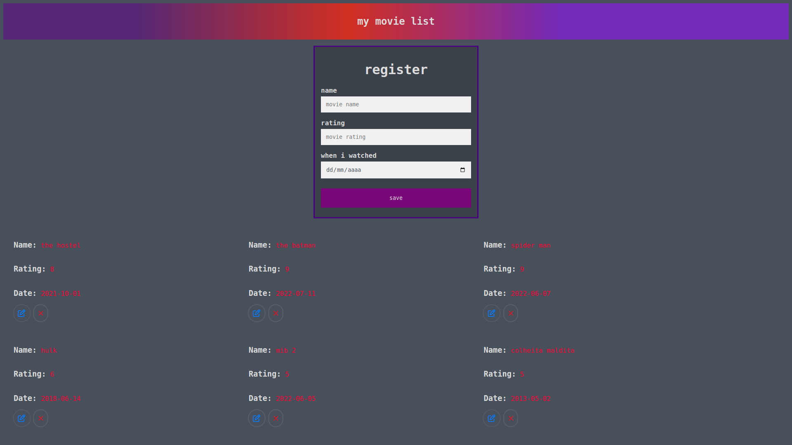

# First PHP Project

## The idea

In this project, the idea was to make a place were people could go and rate a movie with their opinion about the movie.
<br>
Made with functional programming, and the purpose, the user can create a movie, update, edit and delete the movie.
The first PHP project that i've made, so isn't on his best shape, but i pretend to refactor him.
<br>

## Install the project

```
# clone the project
$ git clone git@github.com:thalesmengue/movieList.git

# fill the database variables on the config/process.php file
```

## Technologies
- [PHP 8.0](https://www.php.net/docs.php)



